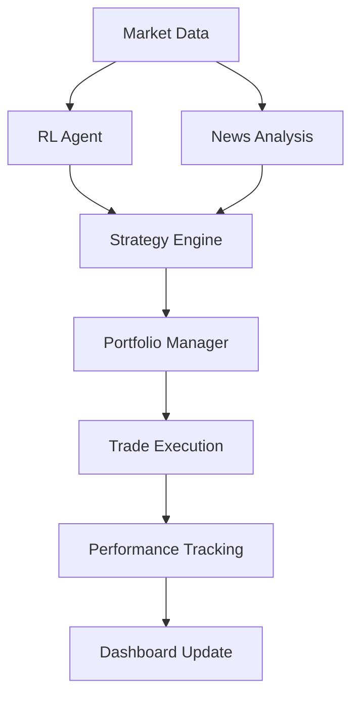

# 📖 User Manual - Stock AI Trading System

Manuale completo per utilizzare al meglio il **Stock AI Trading System**. Questa guida copre tutte le funzionalità, interfacce e modalità operative del sistema.

---

## 📚 **Indice**

1. [🎯 Panoramica Sistema](#-panoramica-sistema)
2. [💻 Interfacce Utente](#-interfacce-utente)
3. [🤖 RL Agent Operations](#-rl-agent-operations)
4. [📰 News Trading System](#-news-trading-system)
5. [💰 Portfolio Management](#-portfolio-management)
6. [📊 Performance Monitoring](#-performance-monitoring)
7. [⚙️ Configurazione Avanzata](#-configurazione-avanzata)
8. [🚨 Alert System](#-alert-system)
9. [🛠️ Troubleshooting](#-troubleshooting)

---

## 🎯 **Panoramica Sistema**

### **🏗️ Architettura Modulare**

Il sistema è composto da **6 moduli principali**:

| Modulo | Funzione | File Principali |
|--------|----------|----------------|
| **🤖 RL Agent** | AI trading decisions | `rl_agent.py`, `train_rl.py` |
| **📰 News Trading** | Sentiment-based trading | `news_based_trading_ai.py` |
| **💰 Portfolio** | Position management | `portfolio.py` |
| **📊 Data Collector** | Market data acquisition | `data_collector.py` |
| **🎯 Strategy Engine** | Multi-strategy coordination | `strategy_engine.py` |
| **🌐 Dashboard** | Web interfaces | `web_dashboard.py`, `news_web_dashboard.py` |

### **🔄 Flusso Operativo**



---

## 💻 **Interfacce Utente**

### **🌐 Web Dashboard (Principale)**

**URL**: `http://localhost:5000`

#### **📊 Overview Section**
```
💰 Portfolio Value: $10,247.50 (+2.48%)
📈 Daily P&L: +$97.35 (+0.98%)
🎯 Win Rate: 68.5% (37/54 trades)
📊 Sharpe Ratio: 1.24
```

**Componenti**:
- **Real-time Portfolio Value**: Aggiornamento ogni 30s
- **Daily Performance**: P&L e % return del giorno
- **Trade Statistics**: Win rate, total trades, avg hold time
- **Risk Metrics**: Sharpe ratio, max drawdown, volatility

#### **📈 Charts Section**
- **Price Charts**: Candlestick con segnali RL sovrapposti
- **Portfolio Performance**: Equity curve vs benchmark
- **Drawdown Chart**: Periodi di perdita
- **Allocation Pie**: Distribuzione portfolio per simbolo

#### **💰 Portfolio Section**
```
Current Positions:
├── AAPL: 28 shares ($4,908.40) ↗ +1.2%
├── GOOGL: 15 shares ($2,189.85) ↗ +3.1%
└── TSLA: 8 shares ($998.95) ↘ -0.8%

Cash: $2,150.30 (21.0%)
Total: $10,247.50
```

**Funzionalità**:
- **Position Details**: Quantità, valore, P&L per posizione
- **Quick Actions**: Pulsanti per buy/sell immediato
- **Risk Indicators**: Heat map risk per posizione
- **Order History**: Storico trades con dettagli

#### **⚙️ Settings Section**
- **Symbol Selection**: Aggiungi/rimuovi simboli monitored
- **Risk Parameters**: Max position size, stop-loss levels
- **Trading Mode**: Simulation/Paper/Live toggle
- **Alert Configuration**: Threshold e notification methods

### **📰 News Dashboard**

**URL**: `http://localhost:5001`

#### **📡 Live News Feed**
```
🔥 Breaking News (2 min ago)
Apple Reports Record Q4 Earnings
Sentiment: +0.75 | Source: Reuters | Impact: HIGH

📰 Recent Articles (15 min ago)
Tesla Stock Upgraded by Goldman Sachs
Sentiment: +0.45 | Source: CNBC | Impact: MEDIUM
```

**Features**:
- **Real-time Stream**: Nuove notizie evidenziate
- **Sentiment Scoring**: Visual sentiment indicators
- **Source Filtering**: Filter per fonte specifica
- **Impact Assessment**: Classificazione HIGH/MEDIUM/LOW

#### **🎯 Trading Signals**
```
Active Signals:
├── AAPL: STRONG BUY (Conf: 85%) 📈
├── TSLA: SELL (Conf: 72%) 📉  
└── GOOGL: HOLD (Conf: 45%) ➖
```

**Informazioni per Signal**:
- **Direction**: BUY/SELL/HOLD con strength
- **Confidence**: % fiducia nel segnale
- **News Count**: Numero articoli che influenzano
- **Time Decay**: Età del segnale

#### **📊 Sentiment Analytics**
- **Symbol Sentiment**: Grafici sentiment per simbolo
- **News Volume**: Numero articoli per time period
- **Source Reliability**: Rating affidabilità fonti
- **Correlation Analysis**: Correlazione sentiment-prezzi

### **💻 Command Line Interface**

#### **🔧 Main CLI (`src/cli_monitor.py`)**

```bash
# Monitor portfolio in tempo reale
python src/cli_monitor.py

# Output:
╭─────────────────────────────────────────────╮
│           STOCK AI TRADING SYSTEM           │
│                Live Monitor                 │
╰─────────────────────────────────────────────╯

💰 Portfolio: $10,247.50 (+2.48%)
📊 Active Positions: 3
🤖 RL Agent: ACTIVE | Last Signal: BUY AAPL
📰 News Feed: 23 articles (last 1h)

[14:32:15] 📈 AAPL: $175.30 → $175.85 (+0.31%)
[14:32:16] 🎯 RL Signal: GOOGL HOLD (conf: 0.62)
[14:32:17] 📰 Breaking: Tesla announces new factory
```

**Comandi Disponibili**:
```bash
# Portfolio operations
python src/cli_monitor.py portfolio status
python src/cli_monitor.py portfolio history
python src/cli_monitor.py portfolio risk

# Trading operations  
python src/cli_monitor.py trade buy AAPL 10
python src/cli_monitor.py trade sell TSLA 5
python src/cli_monitor.py trade status

# System control
python src/cli_monitor.py start --mode simulation
python src/cli_monitor.py stop
python src/cli_monitor.py restart
```

#### **📰 News CLI (`trading-new/news_trading_cli.py`)**

```bash
# Analisi news completa
python trading-new/news_trading_cli.py news
```

**Output Tipico**:
```
📰 NEWS ANALYSIS REPORT

RSS Collection:
├── Sources Active: 6/10 (60%)
├── Articles Collected: 47 (last hour)
├── Breaking News: 3 items
└── Processing Time: 2.3s

Sentiment Analysis:
├── AAPL: +0.35 (Positive) | 12 articles
├── GOOGL: +0.12 (Neutral) | 8 articles  
├── TSLA: -0.18 (Negative) | 15 articles
└── Overall Market: +0.08 (Slightly Positive)

Trading Signals Generated:
├── BUY Signals: 2 (AAPL, GOOGL)
├── SELL Signals: 1 (TSLA)
└── HOLD Signals: 0
```

**Altri Comandi News**:
```bash
# Solo segnali correnti
python trading-new/news_trading_cli.py signals

# Ciclo completo (collect + analyze + trade)
python trading-new/news_trading_cli.py cycle

# Modalità auto (loop continuo)
python trading-new/news_trading_cli.py auto --interval 300

# Breaking news alerts
python trading-new/news_trading_cli.py alerts
```

---

## 🤖 **RL Agent Operations**

### **🎓 Training del Modello**

#### **🏋️ Training Completo**

```bash
# Training standard (1000 episodes)
python src/train_rl.py

# Training con parametri custom
python src/train_rl.py --episodes 2000 --symbols AAPL,GOOGL,MSFT --period 2y
```

**Parametri Training**:
```bash
--episodes 1000          # Numero episodi training
--symbols AAPL,GOOGL     # Simboli per training
--period 2y              # Periodo dati storici
--learning_rate 0.001    # Learning rate
--batch_size 32          # Batch size
--memory_size 10000      # Experience replay buffer
--epsilon_start 1.0      # Esplorazione iniziale
--epsilon_end 0.05       # Esplorazione finale
--save_interval 100      # Salva model ogni N episodes
```

**Output Training**:
```
🎓 TRAINING RL AGENT

Episode 1/1000:
├── Total Reward: -125.34
├── Portfolio Value: $9,874.66
├── Actions: 15 BUY, 8 SELL, 77 HOLD
├── Epsilon: 1.000
└── Loss: 0.234

Episode 100/1000:
├── Total Reward: 45.67
├── Portfolio Value: $10,456.70
├── Actions: 12 BUY, 6 SELL, 82 HOLD  
├── Epsilon: 0.905
└── Loss: 0.156

...

🎉 Training Completed!
├── Best Episode: 847 (Reward: 234.56)
├── Final Portfolio: $11,234.56 (+12.35%)
├── Model Saved: data/rl_model.pkl
└── Training Time: 45 min 23s
```

#### **🔄 Fine-tuning**

```bash
# Continua training da model esistente
python src/train_rl.py --resume --episodes 500

# Training su nuovi dati
python src/train_rl.py --update --new_data 1mo
```

### **🎯 Model Evaluation**

```bash
# Valuta performance model
python src/rl_agent.py --evaluate --period 1y
```

**Metrics di Evaluation**:
```
📊 MODEL EVALUATION (1 Year Backtest)

Performance Metrics:
├── Total Return: +18.45%
├── Annualized Return: +18.45%
├── Sharpe Ratio: 1.34
├── Max Drawdown: -8.2%
├── Volatility: 12.3%
└── Win Rate: 64.2%

vs Benchmark (SPY):
├── Benchmark Return: +12.1%
├── Alpha: +6.35%
├── Beta: 0.87
├── Information Ratio: 1.12
└── Tracking Error: 5.6%

Trade Statistics:
├── Total Trades: 156
├── Avg Trade Return: +0.34%
├── Avg Hold Time: 3.2 days
├── Profit Factor: 1.58
└── Maximum Consecutive Losses: 4
```

### **🔧 Model Management**

```bash
# Lista models disponibili
python src/rl_agent.py --list_models

# Carica model specifico
python src/rl_agent.py --load_model data/models/rl_model_v2.pkl

# Compara models
python src/rl_agent.py --compare_models v1,v2,v3

# Export model per produzione
python src/rl_agent.py --export_model --format onnx
```

---

## 📰 **News Trading System**

### **📡 RSS Feed Management**

#### **🔧 Configurazione Fonti**

Edita `config/settings.json`:
```json
{
    "news": {
        "rss_sources": {
            "yahoo_finance": {
                "url": "https://feeds.finance.yahoo.com/rss/2.0/headline",
                "enabled": true,
                "priority": "high",
                "update_interval": 300
            },
            "cnbc": {
                "url": "https://www.cnbc.com/id/100003114/device/rss/rss.html",
                "enabled": true,
                "priority": "high",
                "update_interval": 300
            },
            "reuters": {
                "url": "http://feeds.reuters.com/reuters/businessNews",
                "enabled": true,
                "priority": "medium",
                "update_interval": 600
            }
        }
    }
}
```

#### **🧪 Test RSS Sources**

```bash
# Test tutte le fonti
python trading-new/news_rss_collector.py --test

# Test fonte specifica
python trading-new/news_rss_collector.py --test --source yahoo_finance

# Debug raccolta
python trading-new/news_rss_collector.py --debug
```

**Output Test**:
```
🧪 RSS SOURCES TEST

Testing 10 RSS sources...

✅ Yahoo Finance: 23 articles (0.8s)
✅ CNBC: 15 articles (1.2s)
✅ Reuters: 12 articles (2.1s)
⚠️  Bloomberg: Timeout (5.0s)
❌ MarketWatch: HTTP 403 Error
✅ Seeking Alpha: 8 articles (1.5s)

Summary:
├── Active Sources: 6/10 (60%)
├── Total Articles: 58
├── Average Response Time: 1.8s
└── Error Rate: 20%
```

### **🧠 Sentiment Analysis**

#### **🔬 Metodi di Analisi**

Il sistema utilizza **3 metodi combinati**:

1. **TextBlob** (30% peso):
```python
from textblob import TextBlob
polarity = TextBlob(text).sentiment.polarity  # -1 a +1
```

2. **VADER** (40% peso):
```python
from vaderSentiment.vaderSentiment import SentimentIntensityAnalyzer
analyzer = SentimentIntensityAnalyzer()
score = analyzer.polarity_scores(text)['compound']
```

3. **Financial Dictionary** (30% peso):
```python
# Dizionario 500+ termini finanziari
financial_terms = {
    'earnings beat': 0.6,
    'revenue miss': -0.5,
    'upgrade': 0.7,
    'downgrade': -0.7
}
```

#### **🎯 Testing Sentiment**

```bash
# Test sentiment su testo custom
python trading-new/news_sentiment_analyzer.py --test --text "Apple beats earnings expectations"

# Test su articoli live
python trading-new/news_sentiment_analyzer.py --test --live

# Benchmark accuracy
python trading-new/news_sentiment_analyzer.py --benchmark
```

**Output Test**:
```
🧠 SENTIMENT ANALYSIS TEST

Input: "Apple beats earnings expectations"

Method Results:
├── TextBlob: +0.45 (positive)
├── VADER: +0.52 (positive)  
├── Financial Dict: +0.60 (earnings beat detected)
└── Combined: +0.52 (positive)

Confidence: 0.87 (high agreement)
Processing Time: 0.023s
```

### **🎯 Signal Generation**

#### **📊 Trading Logic**

```python
def generate_signal(sentiment_score, confidence, news_count):
    if confidence < 0.6:
        return 'HOLD'  # Incertezza troppo alta
    
    if sentiment_score > 0.3 and confidence > 0.8:
        return 'STRONG_BUY'
    elif sentiment_score > 0.1 and confidence > 0.7:
        return 'BUY'
    elif sentiment_score < -0.1 and confidence > 0.7:
        return 'SELL'
    elif sentiment_score < -0.3 and confidence > 0.8:
        return 'STRONG_SELL'
    else:
        return 'HOLD'
```

#### **⏰ Time Decay**

I segnali perdono forza nel tempo:
```python
# Decay del 10% per ora
decay_factor = math.exp(-hours_since_news * 0.1)
adjusted_sentiment = original_sentiment * decay_factor
```

**Time Decay Schedule**:
| Age | Decay Factor | Effective Sentiment |
|-----|-------------|-------------------|
| 0h | 100% | Sentiment originale |
| 1h | 90% | 90% sentiment |
| 3h | 74% | 74% sentiment |
| 6h | 55% | 55% sentiment |
| 12h | 30% | 30% sentiment |
| 24h | 9% | Quasi ignorato |

---

## 💰 **Portfolio Management**

### **📊 Portfolio Structure**

```python
# Struttura portfolio
{
    "cash": 5150.30,           # Cash disponibile
    "positions": {
        "AAPL": {
            "shares": 28,
            "avg_price": 175.30,
            "current_price": 177.45,
            "market_value": 4968.60,
            "unrealized_pnl": 60.20,
            "pnl_percent": 1.23
        }
    },
    "total_value": 10118.90,
    "initial_value": 10000.00,
    "total_return": 1.19
}
```

### **💼 Position Management**

#### **📈 Opening Positions**

```bash
# Buy tramite CLI
python src/portfolio.py --buy AAPL 10 --price market

# Buy con limite
python src/portfolio.py --buy GOOGL 5 --price 2800 --type limit

# Buy percentuale portfolio
python src/portfolio.py --buy TSLA --percent 10  # 10% del portfolio
```

**Position Sizing Logic**:
```python
# Calcolo dimensione posizione
available_cash = portfolio.cash
max_position_value = portfolio.total_value * max_position_size  # 20%
position_value = min(available_cash, max_position_value)
shares = int(position_value / current_price)
```

#### **📉 Closing Positions**

```bash
# Sell completo
python src/portfolio.py --sell AAPL --all

# Sell parziale
python src/portfolio.py --sell TSLA 15

# Sell con stop-loss
python src/portfolio.py --sell GOOGL --stop_loss 5  # -5%
```

### **🛡️ Risk Management**

#### **⚠️ Risk Limits**

```json
{
    "risk_management": {
        "max_position_size": 0.2,      // 20% max per simbolo
        "max_portfolio_risk": 0.6,     // 60% max investito
        "stop_loss_percent": 0.05,     // 5% stop-loss
        "daily_loss_limit": 0.03,      // 3% perdita giornaliera max
        "consecutive_loss_limit": 3    // Max 3 trades perdenti consecutivi
    }
}
```

#### **🚨 Risk Monitoring**

```bash
# Risk report completo
python src/portfolio.py --risk_report
```

**Output Risk Report**:
```
🛡️ PORTFOLIO RISK ANALYSIS

Position Risk:
├── AAPL: 49.1% (HIGH) - Concentration risk
├── GOOGL: 21.7% (MEDIUM)
├── TSLA: 9.9% (LOW)
└── Cash: 19.3%

Risk Metrics:
├── Portfolio Beta: 1.12 (vs SPY)
├── VaR (95%): -$287.50 (daily)
├── Expected Shortfall: -$425.30
├── Correlation Risk: 0.67 (moderate)
└── Liquidity Risk: LOW

Alert Triggers:
⚠️  AAPL position exceeds 40% limit
⚠️  Daily loss approaching -3% limit (-2.1%)
✅ Stop-losses configured for all positions
✅ Portfolio correlation within limits
```

### **📊 Performance Tracking**

#### **📈 Performance Metrics**

```bash
# Performance report dettagliato
python src/portfolio.py --performance --period 1mo
```

**Key Metrics**:
```
📊 PERFORMANCE REPORT (30 Days)

Return Metrics:
├── Total Return: +5.47%
├── Annualized Return: +71.1%
├── Daily Avg Return: +0.18%
├── Best Day: +2.34% (Oct 15)
└── Worst Day: -1.89% (Oct 22)

Risk-Adjusted:
├── Sharpe Ratio: 1.24
├── Sortino Ratio: 1.67
├── Calmar Ratio: 8.65
├── Max Drawdown: -3.2%
└── Volatility: 11.2%

Trade Analysis:
├── Total Trades: 23
├── Profitable: 15 (65.2%)
├── Avg Win: +1.23%
├── Avg Loss: -0.87%
└── Profit Factor: 1.52

vs Benchmark:
├── SPY Return: +2.1%
├── Alpha: +3.37%
├── Beta: 0.89
├── Tracking Error: 4.2%
└── Information Ratio: 0.80
```

#### **📉 Drawdown Analysis**

```bash
# Analisi drawdown dettagliata
python src/portfolio.py --drawdown_analysis
```

**Drawdown Report**:
```
📉 DRAWDOWN ANALYSIS

Current Drawdown: -1.2% (3 days)
Max Drawdown: -3.2% (Oct 20-24)

Historical Drawdowns:
├── Oct 2023: -3.2% (4 days) - Market correction
├── Sep 2023: -2.1% (2 days) - Fed announcement
├── Aug 2023: -1.8% (3 days) - Earnings miss
└── Jul 2023: -1.5% (1 day) - Technical sell-off

Recovery Stats:
├── Avg Recovery Time: 2.5 days
├── Max Recovery Time: 4 days
├── Current Recovery: In progress (Day 1)
└── Recovery Rate: 100% (all drawdowns recovered)
```

---

## 📊 **Performance Monitoring**

### **🌐 Real-time Dashboard**

#### **📊 Live Metrics**

La dashboard principale mostra:

**Portfolio Overview**:
```
💰 Total Value: $10,247.50 ↗ +2.48%
📈 Daily P&L: +$97.35 (+0.98%)
🎯 YTD Return: +15.3%
📊 Sharpe Ratio: 1.24
```

**Position Details**:
```
Current Holdings:
┌─────────┬─────────┬──────────┬─────────┬──────────┐
│ Symbol  │ Shares  │ Avg Cost │ Current │ P&L      │
├─────────┼─────────┼──────────┼─────────┼──────────┤
│ AAPL    │ 28      │ $175.30  │ $177.45 │ +$60.20  │
│ GOOGL   │ 15      │ $2,789   │ $2,831  │ +$630    │
│ TSLA    │ 8       │ $245.80  │ $242.10 │ -$29.60  │
└─────────┴─────────┴──────────┴─────────┴──────────┘
```

#### **📈 Chart Visualization**

**Portfolio Value Chart**:
- Timeline del valore portfolio
- Benchmark overlay (SPY)
- Drawdown periods evidenziati
- Trade markers per BUY/SELL

**Performance Metrics Chart**:
- Rolling Sharpe ratio
- Rolling volatility
- Rolling correlation vs market

### **📊 Reporting System**

#### **📄 Daily Reports**

```bash
# Genera report giornaliero
python src/reporting.py --daily --date 2023-10-25
```

**Daily Report Example**:
```
📊 DAILY TRADING REPORT - October 25, 2023

Portfolio Summary:
├── Starting Value: $10,150.15
├── Ending Value: $10,247.50
├── Daily Return: +0.96% (+$97.35)
├── Cash: $2,150.30 (21.0%)
└── Positions: 3 active

Trading Activity:
├── Trades Executed: 2
│   ├── BUY AAPL 10 shares @ $175.30
│   └── SELL TSLA 5 shares @ $245.80
├── Transaction Costs: $2.15
└── Net Trading P&L: +$85.40

News Impact:
├── Articles Analyzed: 47
├── News-driven Signals: 3
├── Breaking News Events: 1
└── Sentiment Impact: +$12.50 estimated

AI Performance:
├── RL Agent Signals: 15
├── Signal Accuracy: 73.3% (11/15)
├── News Signal Accuracy: 66.7% (2/3)
└── Combined Strategy Win Rate: 71.4%

Risk Metrics:
├── Daily VaR (95%): -$256.30
├── Actual Loss Risk: -$97.35 (within VaR)
├── Maximum Position Risk: AAPL 48.3%
└── Portfolio Beta: 1.08
```

#### **📈 Weekly Reports**

```bash
# Report settimanale con analisi trend
python src/reporting.py --weekly --week 2023-10-23
```

#### **📊 Monthly Reports**

```bash
# Report mensile completo
python src/reporting.py --monthly --month 2023-10
```

### **🔔 Performance Alerts**

#### **⚠️ Threshold Alerts**

```json
{
    "performance_alerts": {
        "daily_loss_threshold": -0.03,        // -3% daily loss
        "portfolio_loss_threshold": -0.10,    // -10% portfolio loss
        "drawdown_threshold": -0.05,          // -5% drawdown
        "volatility_threshold": 0.25,         // 25% volatility
        "sharpe_ratio_threshold": 0.5         // Sharpe < 0.5
    }
}
```

**Alert Example**:
```
🚨 PERFORMANCE ALERT

Alert Type: DAILY_LOSS_THRESHOLD
Trigger: Daily loss -3.2% exceeds -3.0% threshold
Current Portfolio Value: $9,680.50 (-3.2%)
Previous Close: $10,000.00

Recommended Actions:
├── Review open positions for stop-loss triggers
├── Check news for market-moving events
├── Consider reducing position sizes
└── Monitor for further deterioration

Auto-Actions Taken:
├── Increased stop-loss monitoring frequency
├── Reduced new position sizing to 50%
└── Alert sent to configured channels
```

---

## ⚙️ **Configurazione Avanzata**

### **🎛️ Trading Parameters**

#### **⚙️ Risk Management Settings**

```json
{
    "risk_management": {
        "position_sizing": {
            "method": "fixed_percent",      // fixed_dollar, fixed_percent, kelly
            "max_position_size": 0.20,      // 20% max per position
            "min_position_size": 0.01,      // 1% min per position
            "portfolio_heat": 0.60          // 60% max invested
        },
        "stop_loss": {
            "enabled": true,
            "percent": 0.05,                // 5% stop-loss
            "trailing": true,               // Trailing stop
            "trailing_percent": 0.03        // 3% trailing distance
        },
        "take_profit": {
            "enabled": true,
            "percent": 0.15,                // 15% take-profit
            "partial": true,                // Partial profit-taking
            "partial_percent": 0.50         // Sell 50% at target
        }
    }
}
```

#### **🤖 RL Agent Configuration**

```json
{
    "rl_agent": {
        "architecture": {
            "hidden_layers": [256, 256],
            "activation": "relu",
            "dropout": 0.2,
            "learning_rate": 0.001
        },
        "training": {
            "episodes": 1000,
            "batch_size": 32,
            "memory_size": 10000,
            "target_update": 100,
            "epsilon_start": 1.0,
            "epsilon_end": 0.05,
            "epsilon_decay": 0.995
        },
        "features": {
            "lookback_window": 30,
            "technical_indicators": [
                "sma_10", "sma_20", "sma_50",
                "ema_12", "ema_26",
                "rsi_14", "macd", "bollinger_bands",
                "stochastic", "williams_r", "cci", "atr"
            ],
            "fundamental_data": false,
            "news_sentiment": true
        }
    }
}
```

#### **📰 News Configuration**

```json
{
    "news_trading": {
        "rss_sources": {
            "update_interval": 300,         // 5 minuti
            "timeout": 10,                  // 10s timeout per source
            "retry_attempts": 3,
            "parallel_collection": true
        },
        "sentiment_analysis": {
            "methods": {
                "textblob": {"weight": 0.3, "enabled": true},
                "vader": {"weight": 0.4, "enabled": true},
                "financial_dict": {"weight": 0.3, "enabled": true}
            },
            "confidence_threshold": 0.6,
            "time_decay_rate": 0.1          // 10% per ora
        },
        "signal_generation": {
            "sentiment_thresholds": {
                "strong_buy": 0.3,
                "buy": 0.1,
                "hold": [-0.1, 0.1],
                "sell": -0.1,
                "strong_sell": -0.3
            },
            "confidence_thresholds": {
                "strong_signals": 0.8,
                "normal_signals": 0.7,
                "weak_signals": 0.6
            }
        }
    }
}
```

### **🔧 System Performance**

#### **⚡ Performance Optimization**

```json
{
    "performance": {
        "data_collection": {
            "cache_enabled": true,
            "cache_duration": 300,          // 5 min cache
            "parallel_downloads": true,
            "connection_pool_size": 10
        },
        "processing": {
            "multiprocessing": true,
            "worker_processes": 4,
            "batch_processing": true,
            "batch_size": 50
        },
        "memory_management": {
            "max_memory_usage": 0.8,        // 80% RAM max
            "garbage_collection": true,
            "data_compression": true
        }
    }
}
```

#### **📊 Logging Configuration**

```json
{
    "logging": {
        "level": "INFO",                    // DEBUG, INFO, WARNING, ERROR
        "console_output": true,
        "file_output": true,
        "log_rotation": {
            "max_size": "10MB",
            "backup_count": 5
        },
        "components": {
            "rl_agent": "INFO",
            "news_trading": "INFO",
            "portfolio": "INFO",
            "data_collector": "WARNING",
            "web_dashboard": "ERROR"
        }
    }
}
```

### **🌐 API Configuration**

#### **🔗 External APIs**

```json
{
    "apis": {
        "data_providers": {
            "yahoo_finance": {
                "enabled": true,
                "rate_limit": 100,          // requests per minute
                "timeout": 30,
                "fallback": "alpha_vantage"
            },
            "alpha_vantage": {
                "enabled": false,
                "api_key": "${ALPHA_VANTAGE_API_KEY}",
                "rate_limit": 5,
                "timeout": 30
            }
        },
        "news_providers": {
            "news_api": {
                "enabled": false,
                "api_key": "${NEWS_API_KEY}",
                "rate_limit": 1000,
                "timeout": 15
            }
        }
    }
}
```

#### **🔌 Webhook Configuration**

```json
{
    "webhooks": {
        "alerts": {
            "discord": {
                "enabled": false,
                "webhook_url": "${DISCORD_WEBHOOK_URL}",
                "alert_types": ["critical", "warning"]
            },
            "slack": {
                "enabled": false,
                "webhook_url": "${SLACK_WEBHOOK_URL}",
                "alert_types": ["critical", "warning", "info"]
            }
        },
        "trading_signals": {
            "enabled": false,
            "endpoint": "http://localhost:8080/signals",
            "auth_token": "${WEBHOOK_AUTH_TOKEN}"
        }
    }
}
```

---

## 🚨 **Alert System**

### **📢 Tipi di Alert**

#### **🔴 Critical Alerts**

**Portfolio Loss Alerts**:
```
🚨 CRITICAL: Daily loss -5.2% exceeds -5.0% limit
Portfolio Value: $9,480.50 (was $10,000.00)
Largest Loss: TSLA -$234.50 (-8.9%)
Action Required: Review positions immediately
```

**System Errors**:
```
🚨 CRITICAL: RL Agent not responding
Last Update: 15 minutes ago
Error: Connection timeout to model server
Action Required: Restart RL Agent service
```

#### **⚠️ Warning Alerts**

**Risk Threshold Warnings**:
```
⚠️ WARNING: AAPL position at 22.5% (limit: 20%)
Current Value: $2,250.50
Recommendation: Reduce position by $250.50
Auto-Action: New buy orders disabled for AAPL
```

**Performance Warnings**:
```
⚠️ WARNING: Win rate dropped to 52% (target: >60%)
Recent Performance: 8 wins, 7 losses (last 15 trades)
Recommendation: Review strategy parameters
```

#### **ℹ️ Info Alerts**

**Trading Activity**:
```
ℹ️ INFO: Position opened
Symbol: GOOGL | Action: BUY | Shares: 5
Price: $2,831.50 | Value: $14,157.50
Reason: RL Signal (confidence: 0.78)
```

**News Events**:
```
ℹ️ INFO: Breaking news detected
Title: "Apple announces new iPhone launch"
Sentiment: +0.65 (positive)
Impact: AAPL signal changed to BUY
```

### **🔔 Notification Channels**

#### **💻 Console Alerts**

```bash
# Console output in tempo reale
[14:32:15] 🚨 CRITICAL: Portfolio loss -5.2%
[14:32:16] ⚠️  WARNING: AAPL position exceeds limit
[14:32:17] ℹ️  INFO: BUY signal generated for GOOGL
```

#### **📄 Log File Alerts**

```bash
# File: logs/alerts.log
2023-10-25 14:32:15 - CRITICAL - Portfolio loss -5.2% exceeds limit
2023-10-25 14:32:16 - WARNING - AAPL position 22.5% exceeds 20% limit  
2023-10-25 14:32:17 - INFO - BUY signal generated for GOOGL (conf: 0.78)
```

#### **🌐 Web Dashboard Alerts**

Dashboard mostra:
- **Alert Banner**: Alert critici in evidenza
- **Alert History**: Lista chronologica alert
- **Alert Counter**: Numero alert per tipo
- **Alert Settings**: Configurazione soglie

#### **📱 External Notifications**

**Discord Webhook**:
```json
{
    "embeds": [{
        "title": "🚨 CRITICAL ALERT",
        "description": "Portfolio loss -5.2% exceeds -5.0% limit",
        "color": 15158332,
        "fields": [
            {"name": "Portfolio Value", "value": "$9,480.50", "inline": true},
            {"name": "Daily Loss", "value": "-$519.50 (-5.2%)", "inline": true},
            {"name": "Action Required", "value": "Review positions immediately"}
        ],
        "timestamp": "2023-10-25T14:32:15Z"
    }]
}
```

### **⚙️ Alert Configuration**

#### **🎚️ Threshold Settings**

```bash
# Edita alert thresholds
python src/alert_manager.py --configure
```

**Interactive Configuration**:
```
📊 ALERT CONFIGURATION

Portfolio Loss Alerts:
├── Daily Loss Threshold: -3.0% (current: -5.0%)
├── Portfolio Loss Threshold: -10.0% (current: -15.0%)
├── Position Loss Threshold: -8.0% (current: -10.0%)
└── Drawdown Threshold: -5.0% (current: -8.0%)

Performance Alerts:
├── Win Rate Threshold: 60% (current: 55%)
├── Sharpe Ratio Threshold: 1.0 (current: 0.8)
├── Volatility Threshold: 20% (current: 25%)
└── Maximum Drawdown: -10% (current: -15%)

System Alerts:
├── Agent Response Timeout: 5 min (current: 10 min)
├── Data Update Timeout: 2 min (current: 5 min)
├── Memory Usage Threshold: 80% (current: 85%)
└── Disk Space Threshold: 90% (current: 95%)

Save changes? (y/n):
```

#### **🔧 Alert Management**

```bash
# Disabilita alerts temporaneamente
python src/alert_manager.py --disable --duration 1h

# Abilita solo critical alerts
python src/alert_manager.py --critical_only

# Test alert system
python src/alert_manager.py --test_alerts

# Clear alert history
python src/alert_manager.py --clear_history
```

---

## 🛠️ **Troubleshooting**

### **🔧 Problemi Comuni**

#### **❌ Data Collection Issues**

**Problema**: Yahoo Finance non risponde
```bash
# Sintomi
ERROR: Failed to download data for AAPL
ConnectionError: HTTPSConnectionPool timeout

# Soluzione 1: Test connettività
python -c "import yfinance as yf; print(yf.download('AAPL', period='1d'))"

# Soluzione 2: Cambia user agent
export YF_USER_AGENT="Mozilla/5.0 (Windows NT 10.0; Win64; x64)"

# Soluzione 3: Usa proxy/VPN se necessario
```

**Problema**: Dati storici incompleti
```bash
# Sintomi
WARNING: Only 180 days of data available for GOOGL (requested 365)

# Soluzione: Aggiusta period/interval
python src/data_collector.py --symbols GOOGL --period 1y --interval 1d --force
```

#### **🤖 RL Agent Issues**

**Problema**: Model non converge durante training
```bash
# Sintomi
Episode 500/1000: Loss: 2.345 (not decreasing)
Portfolio Value: $8,234.50 (declining)

# Diagnosi
python src/train_rl.py --debug --episodes 10

# Soluzione 1: Adjust learning rate
python src/train_rl.py --learning_rate 0.0005

# Soluzione 2: Increase memory buffer
python src/train_rl.py --memory_size 50000

# Soluzione 3: Reset e retrain
rm data/rl_model.pkl
python src/train_rl.py --fresh_start
```

**Problema**: Agent fa solo HOLD actions
```bash
# Sintomi
Actions: 0 BUY, 0 SELL, 100 HOLD (last 100 decisions)

# Diagnosi: Check epsilon value
python src/rl_agent.py --status
# Output: Epsilon: 0.05 (too low for exploration)

# Soluzione: Increase epsilon temporarily
python src/rl_agent.py --set_epsilon 0.3 --temporary 1h
```

#### **📰 News Trading Issues**

**Problema**: RSS feeds non funzionano
```bash
# Sintomi
RSS Collection: 0/10 sources active
Error: Connection timeout for all sources

# Diagnosi
python trading-new/news_rss_collector.py --test --verbose

# Soluzione 1: Check network
curl -I https://feeds.finance.yahoo.com/rss/2.0/headline

# Soluzione 2: Update RSS URLs
python trading-new/news_rss_collector.py --update_sources

# Soluzione 3: Reduce timeout/retry
# Edit config/settings.json: "timeout": 5, "retry_attempts": 2
```

**Problema**: Sentiment analysis errori
```bash
# Sintomi
ERROR: NLTK data not found
ERROR: TextBlob sentiment analysis failed

# Soluzione: Reinstall NLTK data
python -c "import nltk; nltk.download('vader_lexicon'); nltk.download('punkt')"

# Test sentiment
python trading-new/news_sentiment_analyzer.py --test
```

### **🔍 Diagnostic Tools**

#### **🩺 System Health Check**

```bash
# Health check completo
python src/system_health.py --full_check
```

**Output Health Check**:
```
🩺 SYSTEM HEALTH CHECK

✅ Python Environment: 3.10.12
✅ Dependencies: All 23 packages installed
✅ Configuration Files: Valid JSON syntax
✅ Data Directory: 1.2GB used, 50GB available
✅ Model Files: RL model loaded successfully

⚠️  Memory Usage: 1.8GB (75% of 2.4GB available)
⚠️  Network Latency: Yahoo Finance 2.3s (high)
✅ Disk I/O: Normal (15MB/s write, 45MB/s read)

🤖 RL Agent Status:
├── Model Loaded: ✅ v2.1 (Oct 24, 2023)
├── Last Training: 6 days ago
├── Performance: Sharpe 1.24 (good)
└── Response Time: 0.12s (normal)

📰 News System Status:
├── RSS Sources: 6/10 active (60%)
├── Last Update: 2 minutes ago
├── Articles Today: 234
└── Sentiment Engine: ✅ All methods working

💰 Portfolio Status:
├── Total Value: $10,247.50
├── Positions: 3 active
├── Cash: 21.0%
└── Risk Level: Medium

🔗 External Services:
├── Yahoo Finance: ✅ Responding (1.2s)
├── News APIs: ⚠️  1/3 sources down
└── Discord Webhook: ✅ Connected

Recommendations:
├── Reduce memory usage or increase RAM
├── Monitor Yahoo Finance latency
├── Fix news API connections
└── Consider model retraining (>5 days old)
```

#### **📊 Performance Profiler**

```bash
# Profile system performance
python src/performance_profiler.py --duration 60s
```

**Profiler Output**:
```
📊 PERFORMANCE PROFILE (60 seconds)

Function Call Analysis:
├── data_collector.update(): 15 calls, 2.3s total, 0.15s avg
├── rl_agent.get_action(): 45 calls, 0.8s total, 0.018s avg
├── news_analyzer.analyze(): 23 calls, 1.2s total, 0.052s avg
├── portfolio.update_values(): 60 calls, 0.4s total, 0.007s avg
└── dashboard.render(): 4 calls, 0.6s total, 0.15s avg

Memory Usage:
├── Peak Memory: 1.9GB
├── Average Memory: 1.7GB
├── Memory Growth: +45MB (0.7MB/min)
└── GC Collections: 12 (normal)

Network Activity:
├── HTTP Requests: 89 total
├── Data Downloaded: 2.3MB
├── Average Response Time: 1.8s
├── Timeouts: 3 (3.4%)
└── Errors: 1 (1.1%)

Bottlenecks Identified:
⚠️  data_collector.update() taking 15% of CPU time
⚠️  News RSS collection causing network timeouts
✅ RL Agent performance within normal limits
✅ Portfolio calculations efficient
```

### **🔄 Recovery Procedures**

#### **🚨 Emergency Reset**

```bash
# Full system reset (CAREFUL!)
python src/emergency_reset.py --confirm
```

**What Emergency Reset Does**:
- ✅ Stops all running processes
- ✅ Backs up current portfolio/model
- ✅ Resets configuration to defaults
- ✅ Clears cache and temporary files
- ✅ Restarts system with safe settings

#### **💾 Backup & Restore**

```bash
# Create full backup
python src/backup_manager.py --create --name manual_backup_$(date +%Y%m%d)

# List available backups
python src/backup_manager.py --list

# Restore from backup
python src/backup_manager.py --restore --name backup_20231025
```

#### **🔧 Partial Recovery**

```bash
# Reset only portfolio
python src/portfolio.py --reset --confirm

# Reset only RL model
rm data/rl_model.pkl
python src/train_rl.py --quick --episodes 100

# Reset only news system
python trading-new/news_rss_collector.py --reset_cache
python trading-new/news_sentiment_analyzer.py --reset_models
```

---

## 📚 **Riferimenti Aggiuntivi**

### **🔗 Link Rapidi**

- **[[Installation Guide|Installation-Guide]]** - Setup iniziale completo
- **[[Quick Start|Quick-Start]]** - Avvio rapido in 15 minuti  
- **[[Configuration Files|Configuration-Files]]** - Riferimento configurazione
- **[[API Reference|API-Reference]]** - Documentazione API complete

### **🆘 Supporto**

- **GitHub Issues**: [Segnala problemi](https://github.com/risik01/stock-ai/issues)
- **Wiki**: Documentazione estesa
- **Discussions**: [Community Q&A](https://github.com/risik01/stock-ai/discussions)

---

*Questo manuale copre tutte le funzionalità principali del Stock AI Trading System. Per domande specifiche o problemi non coperti, consulta la sezione troubleshooting o apri un issue su GitHub.*
